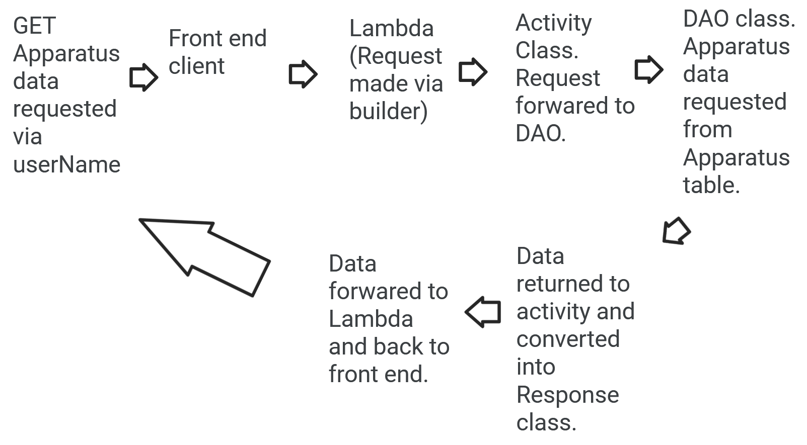
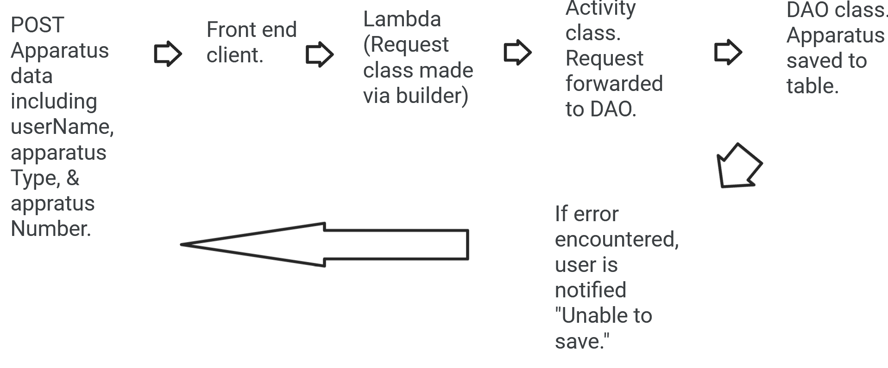
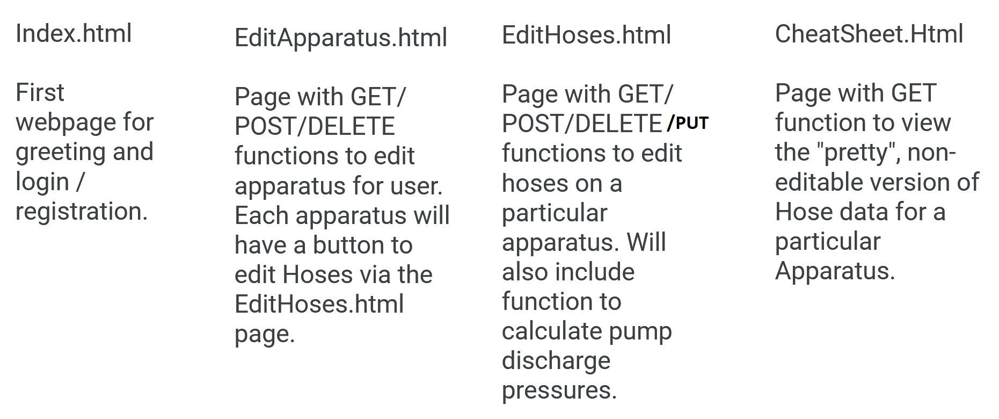
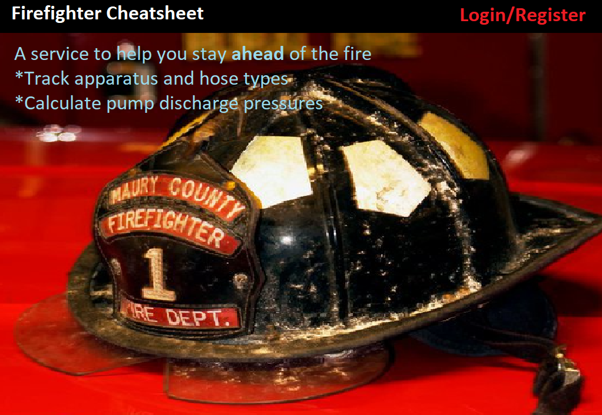
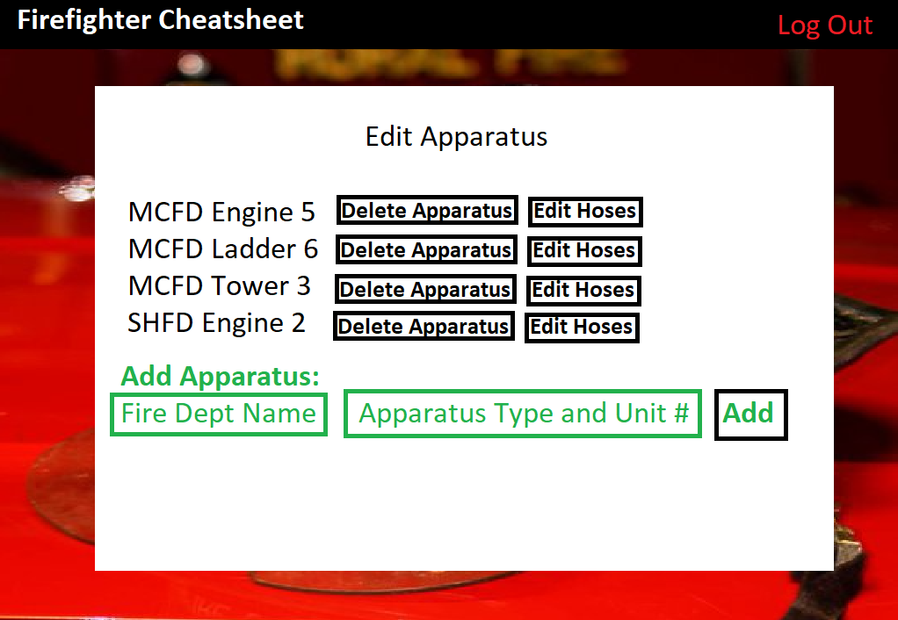
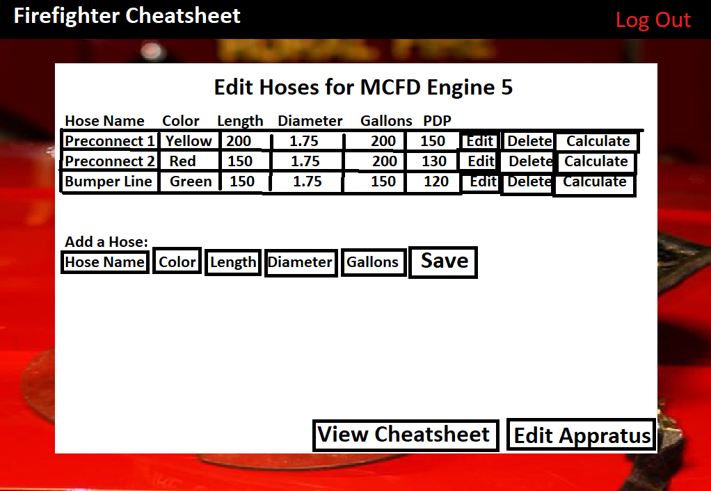
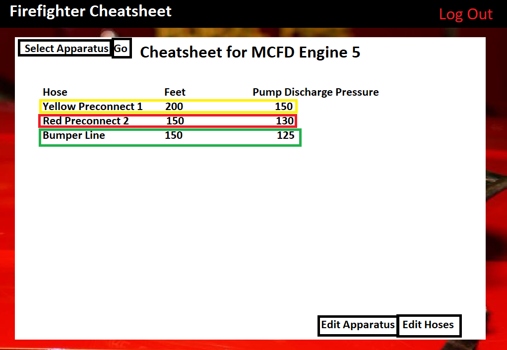

# Design Document

## _Firefighter Cheatsheet_ Design

## 0. Glossary

_**Apparatus:** A land-mobile fire department vehicle such as an Engine, Tanker/Tender, Ladder Truck, Tower, or Quint._ 
_**Appliance:** A special device through which flows water, such as valves and wye-sections._ 
_**Coefficient:** A numerical value associated with a particular diameter hose that is used to calculate pump discharge pressures as part of a formula._ 
_**Driver/Engineer:** A firefighter that is tasked with driving an apparatus and operating the apparatus' pump panel._ 
_**Deck Gun:** A large device on the top of an apparatus that flows water without the use of hoses._ 
_**Nozzle:** The device at the end of a hose which flows water. Often two types: Fog and smooth bore._ 
_**Pump Discharge Pressure:** The PSI (pounds per square inch) pressure at which to set an individual hose on an apparatus' pump panel. Term is often interchangeable with "PSI"._ 
_**Pump Panel:** The area of an apparatus which a driver/engineer controls the flow of water._ 

## 1. Problem Statement

_Firefighters need to pump hoses at certain pump pressures in order to deliver an optimal amount of water to fight fires. Often, firefighters may not know or have forgotten the correct pump discharge pressure to utilize for each hose. This service will allow firefighters to enter apparatus and hoses and calculate the correct pump discharge pressure for each hose, thus making a “cheat sheet” to utilize when they need it most. A firefighter can then print the information as needed._

## 2. Top Questions to Resolve in Review

_List the most important questions you have about your design, or things that you are still debating internally that you might like help working through._

1. What sorts of requests to make (GET vs POST, etc) and when to request them as the application is developed.
2. The overall structure and flow of data.
3. Lambda processes and differentiating between the different types of requests (body vs non-body, etc).

## 3. Use Cases

_This is where we work backwards from the customer and define what our customers would like to do (and why). You may also include use cases for yourselves (as developers), or for the organization providing the product to customers._

U1. _As a Firefighter Cheatsheet customer, I want to `be able to make an account` when I `access the website`._

U2. _As a Firefighter Cheatsheet customer, I want to `be able to add apparatus` when I `am logged in`._

U3. _As a Firefighter Cheatsheet customer, I want to `add corresponding hoses to each apparatus` when I `am logged in`._

U4. _As a Firefighter Cheatsheet customer, I want to `delete apparatus and corresponding hoses` when I `am logged in`._

U5. _As a Firefighter Cheatsheet customer, I want to `be able to calculate pump discharge pressures` when I `click a button`._

U6. _As a Firefighter Cheatsheet customer, I want to `be able to edit the values on hoses` when I `click a button`._

U7. _As a Firefighter Cheatsheet customer, I want to `save each pump discharge pressure for each hose to my account for later viewing` when I `click a button`._

U8. _As a Firefighter Cheatsheet customer, I want to `be shown fog nozzle and smooth bore pump discharge pressures` when I `see my cheat sheet`._

U9. _As a Firefighter Cheatsheet customer, I want to `color code hoses for easy identification` when I `see my cheatsheet`._

STRETCH10. _As a Firefighter Cheatsheet customer, I want to `add a deck gun` when I `edit my cheatsheet`._

STRETCH11. _As a Firefighter Cheatsheet customer, I want to `add radio frequencies` when I `edit my cheatsheet`._

## 4. Project Scope

_The scope of this project will allow for simple calculations of pump discharge pressures, but will not include more complex hose types which will require more complex calculations._

### 4.1. In Scope

_This design will provide the user with a cheatsheet that can be later utilized on fire scenes. Through this design the user will be able to enter the applicable data and the system will save the data and provide recommended calculations based on the user's entered criteria. This will be accomplished through multiple API requests to various tables in a database._

### 4.2. Out of Scope

_This design scope will not include additional calculations such as supply lines or more complex calculations involving water flow through appliances or hose sizes beyond those handled within the design._

_As time allows, additional features such as the addition of a deck gun pump discharge pressure or radio frequencies may be added._

# 5. Proposed Architecture Overview

_The design will include a front end created with HTML, CSS, and Javascript and a backend written in Java. The frontend will make various API requests which will be routed through lambdas and activities, where tables will be queried via data access objects before finally being converted into responses. As necessary, each API will be a separate entity with its own lambda/request/activity/dao/response framework._

# 6. API

## 6.1. Public Models

`CoefficientModel` (Double hoseDiameter[primary key], Double coefficient) [will be used to populate initial Coefficient table]

`ApparatusModel` (String userName[primary key], String apparatusTypeAndNumber[sort key], String fireDept, List<Hose>)

`HoseModel` (String name, String color, int length, Double hoseDiameter, int waterQuantityInGallons, int pumpDischargePressure)

## 6.2. _GetApparatus Endpoint_

_Name: GetApparatus_  
_Description: After saving the Apparatus, the user should then be able to see the saved Apparatus in their account. This will be accomplished via a GET request to the apparatus table based on userName._   
_HTTP Method: GET_   
_Path: /apparatus/get_  
_Request Body: empty_  
_Errors: "ERROR. Cannot obtain apparatus."_  

## 6.3 _SaveApparatus Endpoint_

_Name: SaveApparatus_  
_Description: While logged in and on an Edit Apparatus page, the user will be able to enter in Apparatus and save those items to the database. This will be accomplished via a POST request to an Apparatus Table._  
_HTTP Method: POST_  
_Path: /apparatus/save_  
_Request Body: userName, apparatusTypeAndNumber, fireDept_  
_Errors: "ERROR: Cannot save apparatus."_  

## 6.4 _GetHoses Endpoint_

_Name: GetHoses_  
_Description: While logged in and on an Edit Hoses page, the user will be able to see the saved Hoses on a particular Apparatus. This will be accomplished via a GET request to the apparatus table based on userName and apparatusTypeAndNumber._  
_HTTP Method: GET_  
_Path: /hoses/get/userName/apparatusTypeAndNumber_  
_Request Body: empty_   
_Errors: "ERROR: Cannot obtain hoses."_  

## 6.5 _SaveHose Endpoint_

_Name: SaveHose_  
_Description: While logged in and on an Edit Hoses page, the user will be able to enter in Hoses and save those items to the database. This will be accomplished via a POST request to an Apparatus Table, based on userName and apparatusTypeAndNumber._  
_HTTP Method: POST_  
_Path: /hoses/save_  
_Request Body: userName, apparatusTypeAndNumber, name, color, length, hoseDiameter, waterQuantityInGallons_  
_Errors: "ERROR: Cannot save apparatus."_  

## 6.6 _UpdateHose Endpoint_

_Name: UpdateHose_  
_Description: While logged in and on an Edit Hoses page, the user will be able to enter hose values and save those items to the database. This will be accomplished via a PUT request to an Apparatus Table, based on userName and apparatusTypeAndNumber._  
_HTTP Method: PUT_  
_Path: /hoses/save_  
_Request Body: userName, apparatusTypeAndNumber, name, color, length, hoseDiameter, waterQuantityInGallons_  
_Errors: "ERROR: Cannot update apparatus."_  

# 7. Tables

_The service will be initially populated with a Coefficient table that will have coefficient data for each hose diameter. Additionally, an Apparatus table will also be utilized._  

**Coefficient Table:** Hose diameter will be the Primary Key. 
[Hose diameter in inches (Coefficient)]  
_1.5 (24)_ 
_1.75 (15)_ 
_2 (8)_ 
_2.5 (2)_ 
_3 (0.8)_ 

**Apparatus Table:** userName will be the Primary Key and apparatusTypeAndNumber will be the Sort Key.  
Additional data:  
_fireDept_   
_List<Hose>_  

_A GlobalSecondaryIndex will also be utilized, based on the Apparatus Table, to allow a user to view all Apparatus for a particular Fire Department. This will utilize the String 'fire dept' in the Apparatus table as a Sort Key._

# 8. Pages

Index.html

EditApparatus.html

EditHoses.html

Cheatsheet.html

