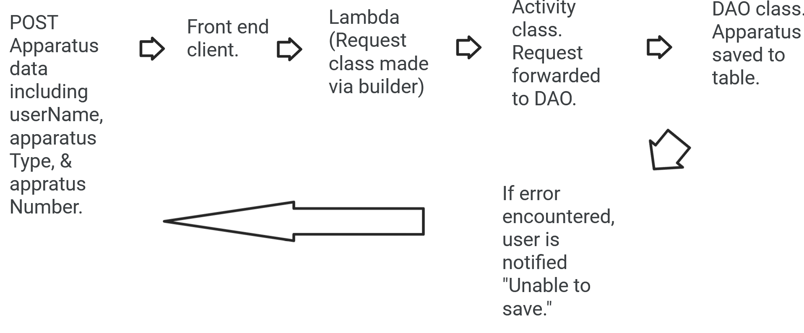

# Design Document

## _Firefighter Cheatsheet_ Design

## 0. Glossary

_**Apparatus:** A land-mobile fire department vehicle such as an Engine, Tanker/Tender, Ladder Truck, Tower, or Quint._ 
_**Appliance:** A special device through which flows water, such as valves and wye-sections._ 
_**Coefficient:** A numerical value associated with a particular diameter hose that is used to calculate pump discharge pressures as part of a formula._ 
_**Driver/Engineer:** A firefighter that is tasked with driving an apparatus and operating the apparatus' pump panel._ 
_**Deck Gun:** A large device on the top of an apparatus that flows water without the use of hoses._ 
_**Nozzle:** The device at the end of a hose which flows water. Often two types: Fog and smooth bore._ 
_**Pump Discharge Pressure:** The PSI (pounds per square inch) pressure at which to set an individual hose on an apparatus' pump panel. Term is often interchangeable with "PSI"._ 
_**Pump Panel:** The area of an apparatus which a driver/engineer controls the flow of water._ 

## 1. Problem Statement

_Firefighters need to pump hoses at certain pump pressures in order to deliver an optimal amount of water to fight fires. Often, firefighters may not know or have forgotten the correct pump discharge pressure to utilize for each hose. This service will allow firefighters to enter apparatus and hoses and calculate the correct pump discharge pressure for each hose, thus making a “cheat sheet” to utilize when they need it most. A firefighter can then print the information as needed._

## 2. Top Questions to Resolve in Review

_List the most important questions you have about your design, or things that you are still debating internally that you might like help working through._

1. What sorts of requests to make (GET vs POST, etc) and when to request them as the application is developed.
2. The overall structure and flow of data.
3. Lambda processes and differentiating between the different types of requests (body vs non-body, etc).

## 3. Use Cases

_This is where we work backwards from the customer and define what our customers would like to do (and why). You may also include use cases for yourselves (as developers), or for the organization providing the product to customers._

U1. _As a Firefighter Cheatsheet customer, I want to `be able to make an account` when I `access the website`. The benefit will be the saving of data to a particular user._

U2. _As a Firefighter Cheatsheet customer, I want to `be able to add apparatus` when I `am logged in`. The benefit will be the saving of apparatus to the user account._

U3. _As a Firefighter Cheatsheet customer, I want to `delete an apparatus ` when I `am logged in`. The benefit will be the ability to delete unnecessary data._

U4. _As a Firefighter Cheatsheet customer, I want to `add corresponding hoses to each apparatus` when I `am logged in`. The benefit will be the saving of hoses for each apparatus._

U5. _As a Firefighter Cheatsheet customer, I want to `delete a specific hose` when I `am logged in`. The benefit will be the ability to delete unnecessary data._

U6. _As a Firefighter Cheatsheet customer, I want to `be able to calculate pump discharge pressures` when I `click a button`. The benefit will be to make complicated calculations_

U7. _As a Firefighter Cheatsheet customer, I want to `calculate a pump discharge pressure (PSI) for each hose` when I `click a button`. The benefit will be the ability to save the pump discharge pressure for later viewing._

U8. _As a Firefighter Cheatsheet customer, I wast to `be able to see a neat, tidy version of hose pump discharge pressures for each Apparatus and hose` when I `click a button to see my cheat sheet`. The benefit will be the ability to print a simple, tidy version of the cheatsheet for later use._

U9. _As a Firefighter Cheatsheet customer, I want to `be shown fog nozzle and smooth bore pump discharge pressures` when I `see my cheat sheet`. The benefit will allow the user to utilize both pump discharge pressures if a nozzle is switched while fighting fire._

STRETCH10. _As a Firefighter Cheatsheet customer, I want to `have a hose color drop down populated by a table` when I `add a hose`. The benefit will be to have this commonly used item alongside the listed hoses._

STRETCH11. _As a Firefighter Cheatsheet customer, I want to `have a hose length drop down populated by a table` when I `add a hose`. The benefit will be to have this commonly used item alongside the listed hoses._

STRETCH12. _As a Firefighter Cheatsheet customer, I want to `have a hose diameter drop down populated by a table` when I `add a hose`. The benefit will be to have this commonly used item alongside the listed hoses._

## 4. Project Scope

_The scope of this project will allow for simple calculations of pump discharge pressures, but will not include more complex hose types which will require more complex calculations._

### 4.1. In Scope

_This design will provide the user with a cheatsheet that can be later utilized on fire scenes. Through this design the user will be able to enter the applicable data and the system will save the data and provide recommended calculations based on the user's entered criteria. This will be accomplished through multiple API requests to various tables in a database._

### 4.2. Out of Scope

_This design scope will not include additional calculations such as supply lines or more complex calculations involving water flow through appliances or hose sizes beyond those handled within the design._

_As time allows, additional features such as the addition of a deck gun pump discharge pressure or radio frequencies may be added._

# 5. Proposed Architecture Overview

_The design will include a front end created with HTML, CSS, and Javascript and a backend written in Java. The frontend will make various API requests which will be routed through lambdas and activities, where tables will be queried via data access objects before finally being converted into responses. As necessary, each API will be a separate entity with its own lambda/request/activity/dao/response framework._

# 6. API

## 6.1. Public Models

`CoefficientModel` (Double hoseDiameter[primary key], Double coefficient) [will be used to populate initial Coefficient table]

`ApparatusModel` (String userName[primary key], String apparatusTypeAndNumber[sort key], String fireDept, List of Hose)

`HoseModel` (String name[primary key], String color, int length, Double hoseDiameter, int waterQuantityInGallons, int pumpDischargePressure)

## 6.2. _GetApparatus Endpoint_

_Name: GetApparatus_  
_Description: The user should then be able to see saved Apparatus associated with their account. This will be accomplished via a GET request to the apparatus table based on userName. This endpoint will additionally used to generate the cheat sheet on the CheatSheet webpage._   
_HTTP Method: GET_   
_Path: /apparatus_  
_Request Body: empty_  
_Errors: "ERROR. Cannot obtain apparatus."_  

## 6.3 _DeleteApparatus Endpoint_

_Name: DeleteApparatus_  
_Description: While logged in and on an Apparatus page, the user will be able to delete from a list of available Apparatus from the page and Apparatus table. This will be accomplished via a DELETE request to the Apparatus Table._  
_HTTP Method: DELETE_  
_Path: /apparatus/{apparatusTypeAndNumber}  
_Request Body: empty_  
_Errors: "ERROR: Cannot delete apparatus."_  

## 6.4 _AddApparatus Endpoint_

_Name: AddApparatus_  
_Description: While logged in and on an Apparatus page, the user will be able to enter in Apparatus and save that Apparatus to the Apparatus table. This will be accomplished via a POST request to an Apparatus Table._  
_HTTP Method: POST_  
_Path: /apparatus  
_Request Body: fireDept, apparatusTypeAndNumber_ 
_Errors: "ERROR: Cannot add apparatus."_  

## 6.5 _GetIndividualApparatus Endpoint_

_Name: AddApparatus_  
_Description: The user will be able to obtain data related to an individual apparatus under their account. This will be accomplished via a GET request to the Apparatus Table using the userName and apparatusTypeAndNumber_  
_HTTP Method: GET_  
_Path: /apparatus/{apparatusTypeAndNumber}  
_Request Body: fireDept, apparatusTypeAndNumber_ 
_Errors: "ERROR: Cannot find apparatus."_  

## 6.6 _DeleteHose Endpoint_

_Name: DeleteHose_  
_Description: While logged in the user will be able to delete an individual hose on a particular Apparatus. This will be accomplished via a DELETE request to the apparatus table based on userName, apparatusTypeAndNumber, and a hose index number_  
_HTTP Method: DELETE_  
_Path: /apparatus/hose_  
_Request Body: empty_   
_Errors: "ERROR: Cannot delete hoses."_  

## 6.7 _AddHose Endpoint_

_Name: AddHose_  
_Description: While logged in the user will be able to enter in a Hose with particular values and save the hose to the particular Apparatus. This will be accomplished via a PUT request to an Apparatus Table, based on userName and apparatusTypeAndNumber._  
_HTTP Method: POST_  
_Path: /apparatus/hose_  
_Request Body: fireDept, apparatusTypeAndNumber, name, color, length, diameter, gallons_  
_Errors: "ERROR: Cannot save hose."_  

## 6.8 _CalculatePSI Endpoint_

_Name: CalculatePSI_  
_Description: While logged in, the user will be able to calculate a PSI/Pump Discharge Pressure for a particular Hose. This will be accomplished via a PUT request to update the Apparatus Table, based on userName, apparatusTypeAndNumber, and hoseIndexNumber._  
_HTTP Method: PUT_  
_Path: /apparatus/hose/calculate_  
_Request Body: fireDept, apparatusTypeAndNumber, hoseIndexNumber_  
_Errors: "ERROR: Cannot calculate PSI."_  

# 7. Tables

_The service will be initially populated with a Coefficient table that will have coefficient data for each hose diameter. Additionally, an Apparatus table will also be utilized._  

**Coefficient Table:** Hose diameter will be the Primary Key. 
[Hose diameter in inches (Coefficient in parentheses)]  
_1.5 (24)_ 
_1.75 (15)_ 
_2 (8)_ 
_2.5 (2)_ 
_3 (0.8)_ 

**Apparatus Table:** userName will be the Primary Key and apparatusTypeAndNumber will be the Sort Key.  
Additional data:  
_fireDept: The fire department associated with this particular apparatus._   
_List of Hose: A list of hoses associated with this particular apparatus._  

_A GlobalSecondaryIndex will also be utilized, based on the Apparatus Table and named "FireDeptAndAppTypeNumIndex". This will allow a user to view a particular Apparatus based on fireDept (Hash Key) and apparatusTypeAndNumber(Sort Key)._
_A GlobalSecondaryIndex will also be utilized, based on the Apparatus Table, to allow a user to view all Apparatus for a particular Fire Department. This will utilize the String 'fire dept' in the Apparatus table as a Sort Key._

# 8. Pages

All webpages will be dynamically loaded via Javascript methods. However, there will be four primary "sections" to the website:

-A main page with a simple login button.
-A page to add and delete apparatus.
-A page to add and delete hoses for each individual apparatus.
-A cheat sheet page that shows a simplified version of the Apparatus and Hose data.

Index.html

EditApparatus.html

EditHoses.html

Cheatsheet.html

